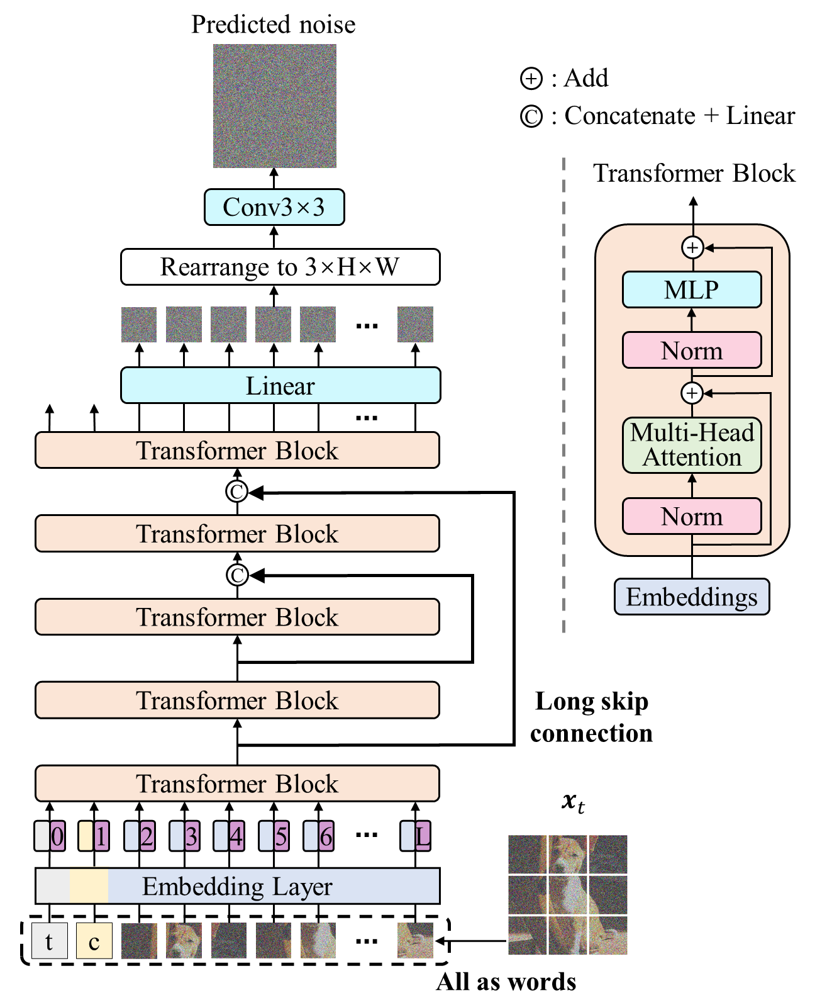
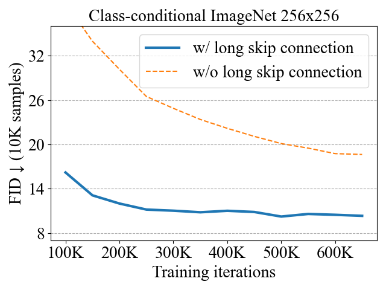
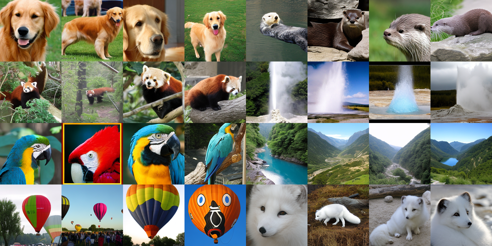

## U-ViT<br> <sub><small>Official PyTorch implementation of [All are Worth Words: A ViT Backbone for Diffusion Models](https://arxiv.org/abs/2209.12152) (CVPR 2023)</small></sub>


💡Projects with U-ViT: 
* [UniDiffuser](https://github.com/thu-ml/unidiffuser), a multi-modal large-scale diffusion model based on a 1B U-ViT, is open-sourced
* [DPT](https://arxiv.org/abs/2302.10586), [code](https://github.com/ML-GSAI/DPT), [demo](https://ml-gsai.github.io/DPT-demo) a conditional diffusion model trained with 1 label/class with SOTA SSL generation and classification results on ImageNet



Vision transformers (ViT) have shown promise in various vision tasks while the U-Net based on a convolutional neural network (CNN) remains dominant in diffusion models. 
We design a simple and general ViT-based architecture (named U-ViT) for image generation with diffusion models. 
U-ViT is characterized by treating all inputs including the time, condition and noisy image patches as tokens 
and employing long skip connections between shallow and deep layers. 
We evaluate U-ViT in unconditional and class-conditional image generation, 
as well as text-to-image generation tasks, where U-ViT is comparable if not superior to a CNN-based U-Net of a similar size. 
In particular, latent diffusion models with U-ViT achieve record-breaking FID scores of 2.29 in class-conditional image generation 
on ImageNet 256x256, and 5.48 in text-to-image generation on MS-COCO, among methods without accessing 
large external datasets during the training of generative models.

Our results suggest that, for diffusion-based image modeling, the long skip connection is crucial while the down-sampling and up-sampling operators in CNN-based U-Net are not always necessary. We believe that U-ViT can provide insights for future research on backbones in diffusion models and benefit generative modeling on large scale cross-modality datasets.

--------------------


This codebase implements the transformer-based backbone 📌*U-ViT*📌 for diffusion models, as introduced in the [paper](https://arxiv.org/abs/2209.12152).
U-ViT treats all inputs as tokens and employs long skip connections. *The long skip connections grealy promote the performance and the convergence speed*.





💡This codebase contains:
* An implementation of [U-ViT](libs/uvit.py) with optimized attention computation
* Pretrained U-ViT models on common image generation benchmarks (CIFAR10, CelebA 64x64, ImageNet 64x64, ImageNet 256x256, ImageNet 512x512)
* Efficient training scripts for [pixel-space diffusion models](train.py), [latent space diffusion models](train_ldm_discrete.py) and [text-to-image diffusion models](train_t2i_discrete.py)
* Efficient evaluation scripts for [pixel-space diffusion models](eval.py) and [latent space diffusion models](eval_ldm_discrete.py) and [text-to-image diffusion models](eval_t2i_discrete.py)
* A Colab notebook demo for sampling from U-ViT on ImageNet (FID=2.29) [](https://colab.research.google.com/github/baofff/U-ViT/blob/main/UViT_ImageNet_demo.ipynb)





💡This codebase supports useful techniques for efficient training and sampling of diffusion models:
* Mixed precision training with the [huggingface accelerate](https://github.com/huggingface/accelerate) library (🥰automatically turned on)
* Efficient attention computation with the [facebook xformers](https://github.com/facebookresearch/xformers) library (needs additional installation)
* Gradient checkpointing trick, which reduces ~65% memory (🥰automatically turned on)
* With these techniques, we are able to train our largest U-ViT-H on ImageNet at high resolutions such as 256x256 and 512x512 using a large batch size of 1024 with *only 2 A100*❗


Training speed and memory of U-ViT-H/2 on ImageNet 256x256 using a batch size of 128 with a A100:

| mixed precision training | xformers | gradient checkpointing |  training speed   |    memory     |
|:------------------------:|:--------:|:----------------------:|:-----------------:|:-------------:|
|            ❌             |    ❌     |           ❌            |         -         | out of memory |
|            ✔             |    ❌     |           ❌            | 0.97 steps/second |   78852 MB    |
|            ✔             |    ✔     |           ❌            | 1.14 steps/second |   54324 MB    |
|            ✔             |    ✔     |           ✔            | 0.87 steps/second |   18858 MB    |


## Dependency

```sh
pip install torch torchvision --extra-index-url https://download.pytorch.org/whl/cu116  # install torch-1.13.1
pip install accelerate==0.12.0 absl-py ml_collections einops wandb ftfy==6.1.1 transformers==4.23.1

# xformers is optional, but it would greatly speed up the attention computation.
pip install -U xformers
pip install -U --pre triton
```

* This repo is based on [`timm==0.3.2`](https://github.com/rwightman/pytorch-image-models), for which a [fix](https://github.com/rwightman/pytorch-image-models/issues/420#issuecomment-776459842) is needed to work with PyTorch 1.8.1+. (Perhaps other versions also work, but I haven't tested it.)
* We highly suggest install [xformers](https://github.com/facebookresearch/xformers), which would greatly speed up the attention computation for *both training and inference*.


## Pretrained Models


|                                                         Model                                                          |  FID  | training iterations | batch size |
|:----------------------------------------------------------------------------------------------------------------------:|:-----:|:-------------------:|:----------:|
|      [CIFAR10 (U-ViT-S/2)](https://drive.google.com/file/d/1yoYyuzR_hQYWU0mkTj659tMTnoCWCMv-/view?usp=share_link)      | 3.11  |        500K         |    128     |
|   [CelebA 64x64 (U-ViT-S/4)](https://drive.google.com/file/d/13YpbRtlqF1HDBNLNRlKxLTbKbKeLE06C/view?usp=share_link)    | 2.87  |        500K         |    128     |
|  [ImageNet 64x64 (U-ViT-M/4)](https://drive.google.com/file/d/1igVgRY7-A0ZV3XqdNcMGOnIGOxKr9azv/view?usp=share_link)   | 5.85  |        300K         |    1024    |
|  [ImageNet 64x64 (U-ViT-L/4)](https://drive.google.com/file/d/19rmun-T7RwkNC1feEPWinIo-1JynpW7J/view?usp=share_link)   | 4.26  |        300K         |    1024    |
| [ImageNet 256x256 (U-ViT-L/2)](https://drive.google.com/file/d/1w7T1hiwKODgkYyMH9Nc9JNUThbxFZgs3/view?usp=share_link)  | 3.40  |        300K         |    1024    |
| [ImageNet 256x256 (U-ViT-H/2)](https://drive.google.com/file/d/13StUdrjaaSXjfqqF7M47BzPyhMAArQ4u/view?usp=share_link)  | 2.29  |        500K         |    1024    |
| [ImageNet 512x512 (U-ViT-L/4)](https://drive.google.com/file/d/1mkj4aN2utHMBTWQX9l1nYue9vleL7ZSB/view?usp=share_link)  | 4.67  |        500K         |    1024    |
| [ImageNet 512x512 (U-ViT-H/4)](https://drive.google.com/file/d/1uegr2o7cuKXtf2akWGAN2Vnlrtw5YKQq/view?usp=share_link)  | 4.05  |        500K         |    1024    |
|      [MS-COCO (U-ViT-S/2)](https://drive.google.com/file/d/15JsZWRz2byYNU6K093et5e5Xqd4uwA8S/view?usp=share_link)      | 5.95  |         1M          |    256     |
|   [MS-COCO (U-ViT-S/2, Deep)](https://drive.google.com/file/d/1gHRy8sn039Wy-iFL21wH8TiheHK8Ky71/view?usp=share_link)   | 5.48  |         1M          |    256     |


## Preparation Before Training and Evaluation

#### Autoencoder
Download `stable-diffusion` directory from this [link](https://drive.google.com/drive/folders/1yo-XhqbPue3rp5P57j6QbA5QZx6KybvP?usp=sharing) (which contains image autoencoders converted from [Stable Diffusion](https://github.com/CompVis/stable-diffusion)). 
Put the downloaded directory as `assets/stable-diffusion` in this codebase.
The autoencoders are used in latent diffusion models.

#### Data
* ImageNet 64x64: Put the standard ImageNet dataset (which contains the `train` and `val` directory) to `assets/datasets/ImageNet`.
* ImageNet 256x256 and ImageNet 512x512: Extract ImageNet features according to `scripts/extract_imagenet_feature.py`.
* MS-COCO: Download COCO 2014 [training](http://images.cocodataset.org/zips/train2014.zip), [validation](http://images.cocodataset.org/zips/val2014.zip) data and [annotations](http://images.cocodataset.org/annotations/annotations_trainval2014.zip). Then extract their features according to `scripts/extract_mscoco_feature.py` `scripts/extract_test_prompt_feature.py` `scripts/extract_empty_feature.py`.

#### Reference statistics for FID
Download `fid_stats` directory from this [link](https://drive.google.com/drive/folders/1yo-XhqbPue3rp5P57j6QbA5QZx6KybvP?usp=sharing) (which contains reference statistics for FID).
Put the downloaded directory as `assets/fid_stats` in this codebase.
In addition to evaluation, these reference statistics are used to monitor FID during the training process.

## Training


We use the [huggingface accelerate](https://github.com/huggingface/accelerate) library to help train with distributed data parallel and mixed precision. The following is the training command:
```sh
# the training setting
num_processes=2  # the number of gpus you have, e.g., 2
train_script=train.py  # the train script, one of <train.py|train_ldm.py|train_ldm_discrete.py|train_t2i_discrete.py>
                       # train.py: training on pixel space
                       # train_ldm.py: training on latent space with continuous timesteps
                       # train_ldm_discrete.py: training on latent space with discrete timesteps
                       # train_t2i_discrete.py: text-to-image training on latent space
config=configs/cifar10_uvit_small.py  # the training configuration
                                      # you can change other hyperparameters by modifying the configuration file

# launch training
accelerate launch --multi_gpu --num_processes $num_processes --mixed_precision fp16 $train_script --config=$config
```


We provide all commands to reproduce U-ViT training in the paper:
```sh
# CIFAR10 (U-ViT-S/2)
accelerate launch --multi_gpu --num_processes 4 --mixed_precision fp16 train.py --config=configs/cifar10_uvit_small.py

# CelebA 64x64 (U-ViT-S/4)
accelerate launch --multi_gpu --num_processes 4 --mixed_precision fp16 train.py --config=configs/celeba64_uvit_small.py 

# ImageNet 64x64 (U-ViT-M/4)
accelerate launch --multi_gpu --num_processes 8 --mixed_precision fp16 train.py --config=configs/imagenet64_uvit_mid.py

# ImageNet 64x64 (U-ViT-L/4)
accelerate launch --multi_gpu --num_processes 8 --mixed_precision fp16 train.py --config=configs/imagenet64_uvit_large.py

# ImageNet 256x256 (U-ViT-L/2)
accelerate launch --multi_gpu --num_processes 8 --mixed_precision fp16 train_ldm.py --config=configs/imagenet256_uvit_large.py

# ImageNet 256x256 (U-ViT-H/2)
accelerate launch --multi_gpu --num_processes 8 --mixed_precision fp16 train_ldm_discrete.py --config=configs/imagenet256_uvit_huge.py

# ImageNet 512x512 (U-ViT-L/4)
accelerate launch --multi_gpu --num_processes 8 --mixed_precision fp16 train_ldm.py --config=configs/imagenet512_uvit_large.py

# ImageNet 512x512 (U-ViT-H/4)
accelerate launch --multi_gpu --num_processes 8 --mixed_precision fp16 train_ldm_discrete.py --config=configs/imagenet512_uvit_huge.py

# MS-COCO (U-ViT-S/2)
accelerate launch --multi_gpu --num_processes 4 --mixed_precision fp16 train_t2i_discrete.py --config=configs/mscoco_uvit_small.py

# MS-COCO (U-ViT-S/2, Deep)
accelerate launch --multi_gpu --num_processes 4 --mixed_precision fp16 train_t2i_discrete.py --config=configs/mscoco_uvit_small.py --config.nnet.depth=16
```


## Evaluation (Compute FID)

We use the [huggingface accelerate](https://github.com/huggingface/accelerate) library for efficient inference with mixed precision and multiple gpus. The following is the evaluation command:
```sh
# the evaluation setting
num_processes=2  # the number of gpus you have, e.g., 2
eval_script=eval.py  # the evaluation script, one of <eval.py|eval_ldm.py|eval_ldm_discrete.py|eval_t2i_discrete.py>
                     # eval.py: for models trained with train.py (i.e., pixel space models)
                     # eval_ldm.py: for models trained with train_ldm.py (i.e., latent space models with continuous timesteps)
                     # eval_ldm_discrete.py: for models trained with train_ldm_discrete.py (i.e., latent space models with discrete timesteps)
                     # eval_t2i_discrete.py: for models trained with train_t2i_discrete.py (i.e., text-to-image models on latent space)
config=configs/cifar10_uvit_small.py  # the training configuration

# launch evaluation
accelerate launch --multi_gpu --num_processes $num_processes --mixed_precision fp16 eval_script --config=$config
```
The generated images are stored in a temperary directory, and will be deleted after evaluation. If you want to keep these images, set `--config.sample.path=/save/dir`.


We provide all commands to reproduce FID results in the paper:
```sh
# CIFAR10 (U-ViT-S/2)
accelerate launch --multi_gpu --num_processes 4 --mixed_precision fp16 eval.py --config=configs/cifar10_uvit_small.py --nnet_path=cifar10_uvit_small.pth

# CelebA 64x64 (U-ViT-S/4)
accelerate launch --multi_gpu --num_processes 4 --mixed_precision fp16 eval.py --config=configs/celeba64_uvit_small.py --nnet_path=celeba64_uvit_small.pth

# ImageNet 64x64 (U-ViT-M/4)
accelerate launch --multi_gpu --num_processes 8 --mixed_precision fp16 eval.py --config=configs/imagenet64_uvit_mid.py --nnet_path=imagenet64_uvit_mid.pth

# ImageNet 64x64 (U-ViT-L/4)
accelerate launch --multi_gpu --num_processes 8 --mixed_precision fp16 eval.py --config=configs/imagenet64_uvit_large.py --nnet_path=imagenet64_uvit_large.pth

# ImageNet 256x256 (U-ViT-L/2)
accelerate launch --multi_gpu --num_processes 8 --mixed_precision fp16 eval_ldm.py --config=configs/imagenet256_uvit_large.py --nnet_path=imagenet256_uvit_large.pth

# ImageNet 256x256 (U-ViT-H/2)
accelerate launch --multi_gpu --num_processes 8 --mixed_precision fp16 eval_ldm_discrete.py --config=configs/imagenet256_uvit_huge.py --nnet_path=imagenet256_uvit_huge.pth

# ImageNet 512x512 (U-ViT-L/4)
accelerate launch --multi_gpu --num_processes 8 --mixed_precision fp16 eval_ldm.py --config=configs/imagenet512_uvit_large.py --nnet_path=imagenet512_uvit_large.pth

# ImageNet 512x512 (U-ViT-H/4)
accelerate launch --multi_gpu --num_processes 8 --mixed_precision fp16 eval_ldm_discrete.py --config=configs/imagenet512_uvit_huge.py --nnet_path=imagenet512_uvit_huge.pth

# MS-COCO (U-ViT-S/2)
accelerate launch --multi_gpu --num_processes 4 --mixed_precision fp16 eval_t2i_discrete.py --config=configs/mscoco_uvit_small.py --nnet_path=mscoco_uvit_small.pth

# MS-COCO (U-ViT-S/2, Deep)
accelerate launch --multi_gpu --num_processes 4 --mixed_precision fp16 eval_t2i_discrete.py --config=configs/mscoco_uvit_small.py --config.nnet.depth=16 --nnet_path=mscoco_uvit_small_deep.pth
```


## References
If you find the code useful for your research, please consider citing
```bib
@inproceedings{bao2022all,
  title={All are Worth Words: A ViT Backbone for Diffusion Models},
  author={Bao, Fan and Nie, Shen and Xue, Kaiwen and Cao, Yue and Li, Chongxuan and Su, Hang and Zhu, Jun},
  booktitle = {CVPR},
  year={2023}
}
```

This implementation is based on
* [Extended Analytic-DPM](https://github.com/baofff/Extended-Analytic-DPM) (provide the FID reference statistics on CIFAR10 and CelebA 64x64)
* [guided-diffusion](https://github.com/openai/guided-diffusion) (provide the FID reference statistics on ImageNet)
* [pytorch-fid](https://github.com/mseitzer/pytorch-fid) (provide the official implementation of FID to PyTorch)
* [dpm-solver](https://github.com/LuChengTHU/dpm-solver) (provide the sampler)
